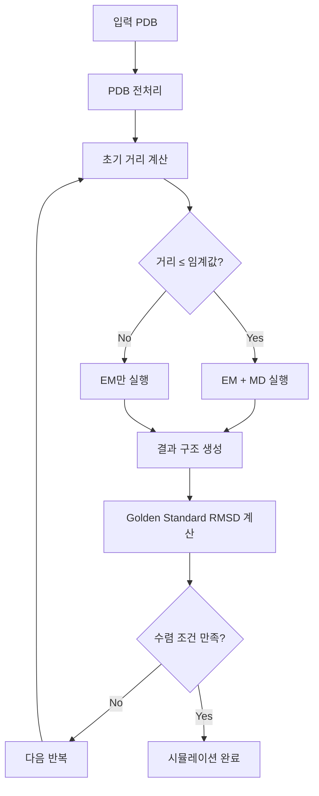

# SUMD Automation System - 지도 분자 동역학 시뮬레이션 자동화 시스템

단백질-리간드 복합체의 결합/해리 과정을 연구하기 위한 SUMD(Supervised Molecular Dynamics) 시뮬레이션 자동화 시스템입니다.

## 🎯 시스템 목표

SUMD Automation System은 다음과 같은 목표를 달성하기 위해 설계되었습니다:

### 주요 연구 목적
- **단백질-리간드 결합 메커니즘 연구**: 두 체인이 어떻게 상호작용하며 결합하는지 관찰
- **네이티브 구조로의 복귀 시뮬레이션**: 변형된 구조가 원래 네이티브 구조로 되돌아가는 과정 분석
- **적응형 시뮬레이션 전략**: 거리에 따라 에너지 최소화(EM) 또는 분자 동역학(MD) 선택적 실행
- **반복적 수렴 달성**: Golden Standard PDB와 비교하여 정량적 수렴 판정

### 핵심 특징
- **다중 샘플링**: 각 반복마다 여러 독립적인 시뮬레이션 실행
- **지도 학습 방식**: 거리 기반 임계값으로 시뮬레이션 방법 자동 선택
- **GPU 가속**: GROMACS MPI + GPU를 활용한 고성능 병렬 계산
- **완전 자동화**: PDB 전처리부터 결과 분석까지 전 과정 자동화

## 🏗️ 시스템 구조

### 핵심 모듈 구성

```
SUMD_automation/
├── robust_sumd_master.py          # 메인 SUMD 시뮬레이션 엔진
├── robust_sumd_master.sh          # Shell 래퍼 스크립트 (사용자 인터페이스)
├── gromacs_runner_class.py        # GROMACS 명령어 실행 관리자
├── interface_distance_calculator.py # 고급 거리 계산 모듈
├── mda_pdb_processor.py           # PDB 전처리 시스템
├── MDPGenerator.py                # GROMACS 매개변수 파일 생성기
├── utils.py                       # 유틸리티 함수 (JSON 인코더 등)
├── gromacs_commands_config.json   # GROMACS 명령어 설정 파일
└── structure_displacer/           # 외부 구조 변형 모듈 (독립적)
```

### 시스템 설계 철학

#### 1. 모듈화 설계
- **독립적인 기능 모듈**: 각 모듈이 특정 기능에 집중하여 유지보수성 향상
- **플러그인 구조**: 외부 모듈(structure_displacer)과 유연한 연동
- **계층적 추상화**: 상위 레벨 API부터 하위 레벨 구현까지 체계적 구성

#### 2. 적응형 알고리즘
- **거리 기반 의사결정**: 체인 간 거리에 따라 최적의 시뮬레이션 방법 자동 선택
- **시스템 크기 인식**: 분자 시스템 크기에 맞는 자동 매개변수 조정
- **GPU 자원 최적화**: 사용 가능한 GPU 리소스에 맞는 병렬화 전략

#### 3. 신뢰성 중심
- **다중 검증**: PDB 파일 유효성, 체인 존재 여부, 원자 완전성 검사
- **Fallback 메커니즘**: 주요 기능 실패 시 대안 방법으로 자동 전환
- **포괄적 로깅**: 전 과정의 상세한 기록을 통한 문제 추적

## 🔧 주요 모듈 설명

### 1. robust_sumd_master.py - 핵심 시뮬레이션 엔진

**역할**: SUMD 시뮬레이션의 전체 흐름을 제어하는 메인 엔진

**주요 클래스 및 함수**:
- `GoldenStandardConvergenceChecker`: Golden Standard PDB와의 RMSD 기반 수렴 판정
- `run_single_sample()`: 단일 샘플 시뮬레이션 실행 (EM/EM+MD 적응적 선택)
- `run_multi_sample_iteration_with_results_saving()`: 다중 샘플 반복 실행
- `analyze_interface_changes()`: 시뮬레이션 전후 인터페이스 변화 분석

**핵심 알고리즘**:
```python
# 적응형 시뮬레이션 선택 로직
if distance <= distance_threshold:
    # 가까운 거리: EM + MD 실행 (정밀한 동역학)
    simulation_type = "EM+MD"
    run_energy_minimization()
    run_molecular_dynamics()
else:
    # 먼 거리: EM만 실행 (빠른 구조 최적화)  
    simulation_type = "EM_only"
    run_energy_minimization()
```

**수렴 판정**:
```python
# Golden Standard 기반 수렴 확인
for iteration in range(max_iterations):
    current_rmsd = calculate_rmsd_with_golden_standard(current_structure)
    rmsd_history.append(current_rmsd)
    
    if len(rmsd_history) >= window_size:
        avg_rmsd = mean(rmsd_history[-window_size:])
        if avg_rmsd <= rmsd_threshold:
            return "converged"
```

### 2. gromacs_runner_class.py - GROMACS 실행 관리자

**역할**: GROMACS 명령어의 체계적 실행 및 오류 처리

**주요 기능**:
- **명령어 템플릿 시스템**: JSON 설정 파일 기반 명령어 자동 생성
- **시스템 크기별 최적화**: 분자 시스템 크기에 따른 매개변수 자동 조정
- **GPU/MPI 설정**: 병렬 계산 환경의 자동 구성
- **재시도 메커니즘**: 실패한 명령어의 자동 재시도

**예시 사용법**:
```python
# GROMACS 실행기 초기화
runner = GromacsCommandRunner(
    work_dir="/path/to/simulation",
    system_size="medium",  # small/medium/large
    config_file="gromacs_commands_config.json"
)

# 에너지 최소화 실행
success, message = runner.execute_gromacs_command("mdrun_em", {
    "prefix": "em",
    "mpi_ranks": "4",
    "gpu_id": "3"
})
```

### 3. interface_distance_calculator.py - 고급 거리 계산

**역할**: 단백질 복합체의 정밀한 거리 측정

**핵심 클래스**:
- `InterfaceDistanceCalculator`: Interface residue 기반 정밀 거리 계산  
- `DistanceCalculator`: 기존 API 호환을 위한 래퍼 클래스

**거리 계산 방법론**:
1. **Interface Residue 식별**: 5.0Å 이내의 상호작용하는 잔기들 찾기
2. **적응형 방법 선택**:
   - Interface가 충분한 경우: Interface 기반 정밀 계산
   - Interface가 부족한 경우: Center of mass 방식으로 fallback
3. **다중 메트릭 계산**: 최소 거리, 평균 거리, 중심간 거리 제공

```python
# Interface 기반 거리 계산
calculator = InterfaceDistanceCalculator(
    interface_cutoff=5.0,      # Interface 정의 임계값
    min_interface_residues=2   # 최소 Interface residue 수
)

distance = calculator.calculate_chain_distance("complex.pdb", "A", "B")
analysis = calculator.get_interface_analysis("complex.pdb", "A", "B")
```

### 4. mda_pdb_processor.py - PDB 전처리 시스템

**역할**: GROMACS 시뮬레이션을 위한 PDB 파일 정제

**처리 파이프라인**:
1. **기본 전처리**: MDAnalysis 우선, Bio.PDB fallback
2. **리간드 제거**: 단백질 원자만 선별적 유지
3. **시스테인 처리**: 누락된 HG 원자 자동 추가
4. **최종 검증**: 구조 완전성 확인

**주요 클래스**:
- `AdvancedPDBProcessor`: 포괄적 PDB 전처리 시스템
- `process_pdb_for_gromacs()`: 사용자 친화적 API 함수

**처리 방법**:
```python
# PDB 전처리 실행
processed_pdb, stats = process_pdb_for_gromacs(
    input_pdb="raw_complex.pdb",
    output_pdb="processed_complex.pdb", 
    target_chains=["A", "B"],
    logger=logger
)

# 처리 통계 확인
print(f"원자 수 변화: {stats['original_atoms']} → {stats['final_atoms']}")
print(f"제거된 잔기: {len(stats['removed_residues'])}개")
```

### 5. MDPGenerator.py - GROMACS 매개변수 생성기

**역할**: 시뮬레이션 조건에 맞는 GROMACS .mdp 파일 자동 생성

**지원하는 시뮬레이션 타입**:
- **에너지 최소화 (EM)**: 구조 최적화용
- **분자 동역학 (MD)**: 동적 시뮬레이션용  
- **이온 삽입**: 시스템 중성화용

**적응형 매개변수**:
```python
# 시뮬레이션 시간과 시스템 크기에 따른 자동 조정
MDPGenerator.generate_em_mdp(
    output_file="em.mdp",
    simulation_time_ns=2.0,    # 시뮬레이션 시간
    system_size="large"        # 시스템 크기 (small/medium/large)
)

# nsteps와 emtol이 자동으로 최적화됨
# large system: 더 많은 steps, 완화된 tolerance
# small system: 적은 steps, 엄격한 tolerance
```

### 6. gromacs_commands_config.json - 설정 관리

**역할**: GROMACS 명령어 템플릿과 시스템별 매개변수 중앙 관리

**주요 설정 섹션**:
- `gromacs_commands`: 각 GROMACS 도구의 명령어 템플릿
- `mpi_settings`: MPI 병렬화 설정
- `gpu_settings`: GPU 가속 설정  
- `timeout_settings`: 시스템 크기별 타임아웃 설정

**설정 예시**:
```json
{
  "gromacs_commands": {
    "mdrun_em": {
      "template": "mpirun --allow-run-as-root -np {mpi_ranks} gmx_mpi mdrun -v -deffnm {prefix} -ntomp {ntomp} -nb {nb_mode} -gpu_id {gpu_id}",
      "defaults": {
        "mpi_ranks": "4",
        "ntomp": "2", 
        "nb_mode": "gpu",
        "gpu_id": "3"
      },
      "large_system_overrides": {
        "mpi_ranks": "6",
        "ntomp": "3"
      }
    }
  }
}
```

## 🚀 사용법

### 기본 사용법

```bash
# 기본 SUMD 시뮬레이션 (Golden Standard 모드)
./robust_sumd_master.sh \
    displaced_complex.pdb \
    native_complex.pdb \
    A B \
    2.0 5.0 1.5 10 5 \
    /app/output
```

**매개변수 설명**:
1. `displaced_complex.pdb`: 시작 구조 (변형된 복합체)
2. `native_complex.pdb`: Golden Standard 구조 (네이티브 복합체)  
3. `A B`: 수용체 체인과 리간드 체인 ID
4. `2.0`: 시뮬레이션 시간 (ns)
5. `5.0`: 거리 임계값 (Å) - EM/MD 선택 기준
6. `1.5`: RMSD 수렴 임계값 (Å)
7. `10`: 최대 반복 횟수
8. `5`: 각 반복당 샘플 수
9. `/app/output`: 출력 디렉토리

### Python API 사용법

```python
# 직접 Python 스크립트 실행
python3 robust_sumd_master.py \
    --input_pdb displaced_complex.pdb \
    --golden_standard_pdb native_complex.pdb \
    --receptor_chain A \
    --ligand_chain B \
    --simulation_time 2.0 \
    --distance_threshold 5.0 \
    --rmsd_threshold 1.5 \
    --max_iterations 10 \
    --num_samples 5 \
    --output_dir /app/output
```

### Structure Displacer 연동

SUMD 시뮬레이션을 위한 시작 구조는 외부 `structure_displacer` 모듈에서 생성된 결과를 활용할 수 있습니다:

```bash
# 1단계: structure_displacer에서 50Å 변형 구조 생성
# (structure_displacer는 독립적인 외부 모듈)
cd structure_displacer
python3 example_workflow.py \
    --golden_standard native_complex.pdb \
    --target_chains A,B \
    --num_variants 5 \
    --skip_sumd \
    --output_dir displaced_output

# 2단계: structure_displacer 결과를 SUMD 입력으로 사용
cd ../
./robust_sumd_master.sh \
    displaced_output/quality_analysis_50A/best_structure.pdb \
    native_complex.pdb \
    A B 2.0 5.0 1.5 10 5 /app/output
```

**Structure Displacer와의 관계**:
- **독립적 모듈**: structure_displacer는 SUMD 시스템과 독립적으로 동작
- **결과 활용**: structure_displacer가 생성한 변형 구조를 SUMD의 시작점으로 사용
- **선택적 연동**: 필요에 따라 다른 소스의 입력 구조도 사용 가능

## 📊 시뮬레이션 워크플로우

### 전체 프로세스



### 반복별 다중 샘플링

각 반복(iteration)에서:
1. **다중 샘플 실행**: 동일 조건으로 N개(기본 5개) 독립 시뮬레이션
2. **최적 샘플 선택**: 목표 체인에 가장 가까운 거리를 달성한 구조 선택
3. **결과 저장**: 각 반복의 최적 구조를 다음 반복의 입력으로 사용

### 수렴 판정 방식

**Golden Standard 기반 수렴**:
- 마지막 5회(기본값) 반복의 평균 RMSD 계산
- RMSD ≤ 임계값(기본 1.5Å)이면 수렴 달성
- 네이티브 구조로의 복귀 정도를 정량적 측정

## 📈 출력 및 결과

### 디렉토리 구조

```
output/sumd_[job_id]/
├── sumd_[job_id].log              # 전체 시뮬레이션 로그
├── results.json                   # 구조화된 결과 데이터
├── simulation_summary.txt         # 사람이 읽기 쉬운 요약
├── iteration_results/             # 반복별 결과 정리
│   ├── iteration_01_best.pdb
│   ├── iteration_02_best.pdb
│   └── ...
├── iteration_1/                   # 1번째 반복 상세 결과
│   ├── sample_1/
│   ├── sample_2/
│   └── ...
└── iteration_2/                   # 2번째 반복 상세 결과
    └── ...
```

### 결과 해석

**results.json 주요 필드**:
```json
{
  "job_id": "시뮬레이션 작업 ID",
  "converged": true,
  "final_pdb": "최종 구조 파일 경로",
  "golden_standard_pdb": "참조 구조 파일",
  "iterations": [
    {
      "iteration": 1,
      "initial_distance": 45.2,
      "final_distance": 12.8,
      "rmsd_vs_golden": 2.3,
      "simulation_type": "EM+MD"
    }
  ],
  "convergence_info": {
    "recent_avg_rmsd": 1.2,
    "converged": true
  }
}
```

**시뮬레이션 성공 지표**:
- `converged: true`: Golden Standard로 수렴 달성
- `rmsd_vs_golden < rmsd_threshold`: 목표 RMSD 이하 달성
- `final_distance < initial_distance`: 체인 간 거리 감소 확인

## ⚙️ 시스템 요구사항

### 필수 소프트웨어
- **GROMACS 2019 이상** (MPI + GPU 지원)
- **Python 3.7+** 
- **CUDA 호환 GPU** (계산 가속용)

### Python 의존성
```bash
pip install numpy scipy matplotlib pandas biopython MDAnalysis
```

### 권장 하드웨어
- **CPU**: 8+ 코어 (다중 샘플 병렬 처리)
- **GPU**: NVIDIA GPU (CUDA 11.0+)
- **메모리**: 16GB+ RAM
- **저장공간**: 50GB+ (시뮬레이션 결과용)

## 🔧 고급 설정

### 시스템 크기별 최적화

```bash
# 소형 시스템 (< 3,000 원자)
./robust_sumd_master.sh input.pdb golden.pdb A B 1.0 5.0 1.5 5 3

# 중형 시스템 (3,000-10,000 원자) - 기본값
./robust_sumd_master.sh input.pdb golden.pdb A B 2.0 5.0 1.5 10 5

# 대형 시스템 (> 10,000 원자)  
./robust_sumd_master.sh input.pdb golden.pdb A B 3.0 8.0 2.0 15 7
```

### GPU 설정 커스터마이징

`gromacs_commands_config.json`에서 GPU 설정 변경:
```json
{
  "gpu_settings": {
    "default_gpu_id": "0",           # 사용할 GPU ID
    "multi_gpu_configurations": {
      "2_gpu": {
        "gpu_ids": "01", 
        "recommended_ranks": "4"
      }
    }
  }
}
```

### 매개변수 튜닝 가이드

**거리 임계값 조정**:
- `distance_threshold`: 작을수록 더 정밀한 MD, 클수록 빠른 EM
- 단백질 크기에 비례하여 조정 (작은 단백질: 3-5Å, 큰 단백질: 5-8Å)

**수렴 조건 조정**:
- `rmsd_threshold`: 엄격할수록 더 정확한 수렴, 관대할수록 빠른 완료
- 시스템 복잡도에 따라 1.0-3.0Å 범위에서 조정

**샘플링 전략**:
- `num_samples`: 많을수록 더 신뢰성 있는 결과, 적을수록 빠른 실행
- 계산 자원과 시간 제약에 따라 3-10개 범위 권장

## 🚨 문제 해결

### 일반적인 문제들

**1. GROMACS 실행 실패**
```bash
# GPU 상태 확인
nvidia-smi

# GROMACS 설치 확인  
gmx --version
which gmx_mpi
```

**2. PDB 전처리 실패**
```bash
# 체인 정보 확인
grep "^ATOM" input.pdb | awk '{print $5}' | sort | uniq

# MDAnalysis 설치 확인
python3 -c "import MDAnalysis; print('OK')"
```

**3. 메모리 부족**
- 시스템 크기를 "small"로 설정
- 샘플 수 줄이기 (`num_samples` 감소)
- MPI 프로세스 수 조정 (`mpi_ranks` 감소)

**4. 수렴하지 않는 경우**
- RMSD 임계값 완화 (1.5Å → 2.0Å)
- 최대 반복 횟수 증가
- 시뮬레이션 시간 증가

### 로그 분석

**주요 로그 파일**:
- `sumd_[job_id].log`: 전체 시뮬레이션 진행 과정
- `iteration_*/sample_*/mdrun.log`: 개별 GROMACS 실행 로그

**성공적인 시뮬레이션 로그 패턴**:
```
INFO - Golden Standard 기반 SuMD 시뮬레이션 시작
INFO - 반복 1 시작
INFO - 체인 간 거리: 45.23 Å
INFO - Golden Standard와의 RMSD: 2.45 Å  
INFO - 수렴 상태: 마지막 5회 평균 RMSD 1.23Å ≤ 1.5Å (수렴)
INFO - 수렴 달성!
```

## 📚 참고 자료

### 관련 모듈
- **[structure_displacer](structure_displacer/README.md)**: 50Å 거리 기반 구조 변형 도구 (독립 모듈)
  - SUMD의 시작 구조 생성에 활용 가능
  - 자체적인 품질 분석 및 시각화 기능 제공

### 추가 도구
- **VMD**: 시뮬레이션 결과 시각화
- **PyMOL**: 구조 분석 및 그림 제작
- **GROMACS 분석 도구**: 궤적 분석 및 에너지 계산

### 사용 예시

**전체 워크플로우 예시**:
```bash
# 1. 테스트 PDB 다운로드 (선택사항)
./download_test_pdb.sh

# 2. 기본 SUMD 시뮬레이션
./robust_sumd_master.sh \
    test_data/complex.pdb \
    test_data/native.pdb \
    A B \
    2.0 5.0 1.5 10 5 \
    /app/output

# 3. 결과 확인
cat /app/output/sumd_*/simulation_summary.txt
```

---

**최종 업데이트**: 2024년  
**버전**: 2.0 (Golden Standard 기반)  
**호환성**: GROMACS 2019+, Python 3.7+  
**GPU 지원**: NVIDIA CUDA 11.0+  
**외부 모듈**: structure_displacer (선택적 연동)